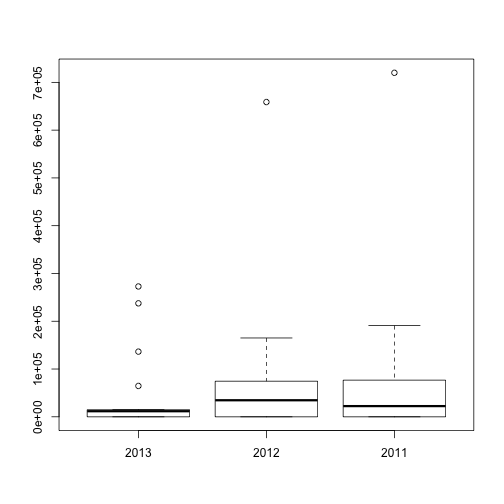

 

```
##       2013              2012              2011       
##  Min.   :  12896   Min.   :      0   Min.   :     0  
##  1st Qu.:  46312   1st Qu.:  34525   1st Qu.: 18096  
##  Median : 300688   Median : 128750   Median : 45000  
##  Mean   : 615912   Mean   : 322798   Mean   : 73360  
##  3rd Qu.:1111500   3rd Qu.: 483162   3rd Qu.: 58500  
##  Max.   :1710000   Max.   :1170000   Max.   :330667  
##  NA's   :18        NA's   :9         NA's   :19
```

 

```
##       2013             2012             2011       
##  Min.   :     0   Min.   :     0   Min.   :     0  
##  1st Qu.:     0   1st Qu.:     0   1st Qu.:     0  
##  Median : 11684   Median : 34628   Median : 22388  
##  Mean   : 43848   Mean   : 73972   Mean   : 69983  
##  3rd Qu.: 14710   3rd Qu.: 74433   3rd Qu.: 73838  
##  Max.   :272800   Max.   :658800   Max.   :720000  
##  NA's   :10       NA's   :5        NA's   :4
```

 

```
##       2013             2012             2011        
##  Min.   :     0   Min.   :     0   Min.   :      0  
##  1st Qu.:     0   1st Qu.:  3142   1st Qu.:  15533  
##  Median :     0   Median : 24875   Median :  57435  
##  Mean   : 27243   Mean   : 55262   Mean   : 140668  
##  3rd Qu.: 23581   3rd Qu.: 71250   3rd Qu.: 138533  
##  Max.   :204350   Max.   :307200   Max.   :1170000  
##  NA's   :8        NA's   :6        NA's   :6
```

 

```
##       2013             2012              2011        
##  Min.   :     0   Min.   :      0   Min.   :      0  
##  1st Qu.: 38593   1st Qu.:  81320   1st Qu.:  18617  
##  Median : 61123   Median : 123750   Median :  36800  
##  Mean   : 91381   Mean   : 244474   Mean   : 151209  
##  3rd Qu.:112375   3rd Qu.: 216111   3rd Qu.:  71625  
##  Max.   :304000   Max.   :1440000   Max.   :1152000  
##  NA's   :12       NA's   :9         NA's   :5
```

 

```
##       2013              2012              2011       
##  Min.   :  23614   Min.   :      0   Min.   :     0  
##  1st Qu.:  50040   1st Qu.:  34075   1st Qu.: 53815  
##  Median :  86802   Median :  88096   Median : 83825  
##  Mean   : 280519   Mean   : 177412   Mean   :176413  
##  3rd Qu.: 211300   3rd Qu.: 156750   3rd Qu.:203375  
##  Max.   :1500000   Max.   :1710000   Max.   :864000  
##  NA's   :12        NA's   :6         NA's   :4
```

 

```
##       2013             2012              2011        
##  Min.   :     0   Min.   :      0   Min.   :      0  
##  1st Qu.: 11832   1st Qu.:  17633   1st Qu.:      0  
##  Median : 47972   Median :  57600   Median :  18930  
##  Mean   :123734   Mean   : 156426   Mean   : 134236  
##  3rd Qu.:181817   3rd Qu.: 140800   3rd Qu.:  96038  
##  Max.   :723600   Max.   :1400000   Max.   :1445000  
##  NA's   :9        NA's   :3
```

 

```
##       2013         2012            2011       
##  Min.   :0    Min.   :    0   Min.   :     0  
##  1st Qu.:0    1st Qu.:    0   1st Qu.:     0  
##  Median :0    Median :    0   Median :     0  
##  Mean   :0    Mean   : 1937   Mean   : 16694  
##  3rd Qu.:0    3rd Qu.:    0   3rd Qu.: 12120  
##  Max.   :0    Max.   :13640   Max.   :175500  
##  NA's   :21   NA's   :11      NA's   :4
```

 

```
##       2013             2012              2011       
##  Min.   :     0   Min.   :      0   Min.   :     0  
##  1st Qu.: 14400   1st Qu.:  14870   1st Qu.: 18295  
##  Median : 46000   Median :  45000   Median : 38034  
##  Mean   : 82448   Mean   : 133317   Mean   : 86862  
##  3rd Qu.:111020   3rd Qu.: 118733   3rd Qu.:100880  
##  Max.   :297600   Max.   :1170000   Max.   :665000  
##  NA's   :11       NA's   :5         NA's   :4
```

 

```
##       2013             2012             2011       
##  Min.   :     0   Min.   :     0   Min.   :     0  
##  1st Qu.: 15810   1st Qu.: 30020   1st Qu.:  4640  
##  Median : 38800   Median :125933   Median : 39343  
##  Mean   : 66932   Mean   :150992   Mean   : 58834  
##  3rd Qu.: 82250   3rd Qu.:242000   3rd Qu.: 74038  
##  Max.   :322400   Max.   :665000   Max.   :288000  
##  NA's   :13       NA's   :4        NA's   :2
```

 

```
##       2013             2012             2011       
##  Min.   :     0   Min.   :     0   Min.   :     0  
##  1st Qu.:     0   1st Qu.:     0   1st Qu.:     0  
##  Median : 16865   Median : 18056   Median :     0  
##  Mean   : 81250   Mean   : 70351   Mean   : 95167  
##  3rd Qu.: 71625   3rd Qu.: 75621   3rd Qu.: 65250  
##  Max.   :604800   Max.   :561600   Max.   :484000  
##  NA's   :12       NA's   :8        NA's   :22
```

 

```
##       2013            2012             2011             2010       
##  Min.   :    0   Min.   :     0   Min.   :     0   Min.   :     0  
##  1st Qu.:    0   1st Qu.: 11230   1st Qu.:     0   1st Qu.:  6948  
##  Median :    0   Median : 18661   Median : 12728   Median : 44475  
##  Mean   :12791   Mean   : 48374   Mean   : 61831   Mean   : 74362  
##  3rd Qu.:13325   3rd Qu.: 46324   3rd Qu.: 45578   3rd Qu.:117600  
##  Max.   :94250   Max.   :363000   Max.   :936000   Max.   :300000  
##  NA's   :7       NA's   :4        NA's   :4        NA's   :3
```

```
## $Name
## [1] "character"
## 
## $Three2013
## [1] "numeric"
## 
## $Six2013
## [1] "numeric"
## 
## $Three2012
## [1] "numeric"
## 
## $Six2012
## [1] "numeric"
## 
## $Three2011
## [1] "numeric"
## 
## $Six2011
## [1] "numeric"
```

```
## Warning: mean(<data.frame>) is deprecated.  Use colMeans() or sapply(*,
## mean) instead.
```

```
## Three2013   Six2013 Three2012   Six2012 Three2011   Six2011 
##    0.6743    0.8804    0.6124    0.7891    0.6795    0.8280
```

```
## Warning: mean(<data.frame>) is deprecated.  Use colMeans() or sapply(*,
## mean) instead.
```

```
## Three2013   Six2013 Three2012   Six2012 Three2011   Six2011 
##    0.6743    0.8804    0.6124    0.7891    0.6795    0.8280
```

67, 88, 61, 79, 68, 83
